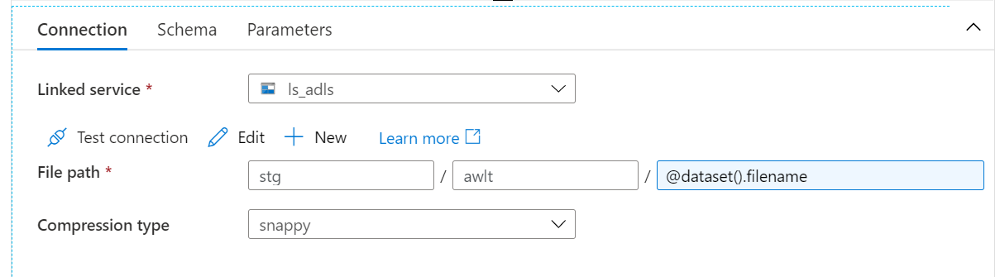
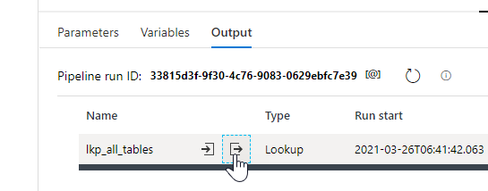
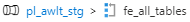
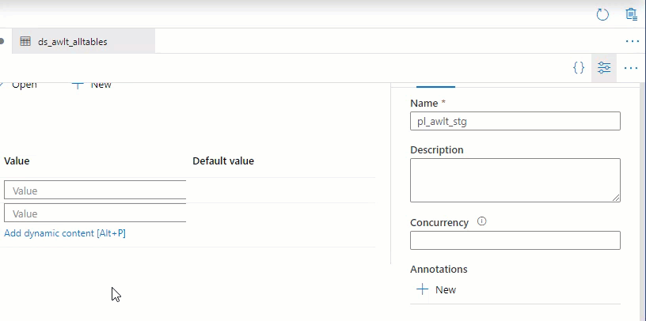

# Lab: data laden met behulp van een for loop

## Doel

In het vorige lab hebben we handmatig data geladen in ons Data Lake. Maar na de zoveelste identieke pipeline vraag je je toch af: kan dat niet geautomatiseerd?

In dit lab gaan we deze handmatige actie daarom veranderen in een geautomatiseerde. Daar gebruiken we een *for loop* voor.

## Opdracht

1. Maak een nieuwe dataset met de naam `ds_awlt`
   * Type: SQL Database
   * Linked Service: `ls_sql_awlt`
   * Laat **Table Name** leeg
1. Voeg aan deze nieuwe dataset twee *parameters* toe
   * Dit doe je in het tabblad **Parameters**
   * Voeg de volgende parameters toe:
     * schema (type: String)
     * tabel (type: String)
   * Vink nu op het tabblad **Connection**, bij **Table** de instelling **Edit** aan
     * Dit geeft je de mogelijkheid om het schema en de tabelnaam in te vullen, of dynamisch te maken
     * Zodra je op één van de vakjes klikt, zie je de blauwe tekst **Add Dynamic Content [Alt+P]** verschijnen.
     * Zorg ervoor dat de parameters voor `schema` en `tabel` hier worden toegepast


3. Maak een tweede dataset met de naam `ds_adls_awlt`
   * Type: Azure Blob Storage
   * Format: Parquet
   * Linked Service: `ls_adls`
   * File system / Container: `stg`
   * Directory: `awlt`
   * Importeer nu geen schema
3. Als de dataset is aangemaakt, kun je ook hier parameters aan toevoegen.
   * Voeg een parameter met de naam `filename` toe
   * Gebruik deze in je **File Path** instelling voor het laatste component (de filename dus)
3. Publiceer de datasets




We hebben nu twee datasets gemaakt die niet aan één bestand of tabel gekoppeld zijn, maar die hun tabellen en bestanden *dynamisch* beschikbaar hebben. Een goed gebruik is om deze taak (het kopiëren) ook in een pipeline te gieten die in zichzelf parameters heeft: net als de dataset een "schema", "tabel" en "filename" had, zal deze pipeline ook twee parameters hebben - en deze gebruiken om ervoor te zorgen dat de bestanden uniform op het Data Lake terecht komen.

6. Maak een nieuwe pipeline met de naam `pl_awlt_adls_object`
   * Geef deze pipeline twee parameters:
     * schema
     * tabel
   * Voeg een **Copy Data** activity toe
     * Naam: `cd_alwt_adls`
     * Source dataset: `ds_awlt`
       * Configureer de parameters van de source dataset nu zo, dat ze de gelijknamige parameters uit de pipeline overnemen
     * Sink dataset: `ds_adsls_awlt`
       * Geef de parameter **filename** van de sink dataset een bestandsnaam die als volgt is opgebouwd:
       * `(schemanaam).(tabelnaam).parquet`
       * Je kunt dit oplossen met *dynamic content* (hint: kijk eens bij de [string functions van de Data Factory expressions](https://docs.microsoft.com/en-us/azure/data-factory/control-flow-expression-language-functions#string-functions))

> ## Expression Language
>
> De expressie-taal die je zojuist gebruikt hebt, is een relatief eenvoudig JSON-gebaseerd taaltje waarmee in diverse Microsoft-producten dynamische waarden kunnen worden toegevoegd. Naast Data Factory kom je het ook bijvoorbeeld tegen in [Logic Apps en Power Automate](https://docs.microsoft.com/en-us/azure/logic-apps/workflow-definition-language-functions-reference).

We hebben nu een dynamische pipeline gemaakt: zolang we aan deze pipeline vertellen wat de staging- en tabelnaam zijn, zorgt de pipeline ervoor dat er een nette export wordt neergezet op de juiste plek. Met dat onderdeel gebouwd kunnen we een stapje hoger gaan kijken: kunnen we deze pipeline nu automatisch aanroepen voor een dataset met staging- en tabelnamen?

Om dat voor elkaar te krijgen zullen we twee zogenaamde *system tables* uitvragen uit SQL Database:

* `sys.objects` bevat alle objecten (tabellen, procedures, etc.) in een database
* `sys.schemas` bevat de namen van schemas

7. Maak een nieuwe pipeline, met de naam `pl_awlt_stg`
8. Voeg in deze pipeline een Lookup activity toe
   * Naam: `lkp_all_tables`
   * Source Dataset (onder het tabje Settings): `ds_awlt`
   * Use Query: **Query**
   * Query:

```sql
select 
    o.name AS table_name
    , s.name AS schema_name
from 
    sys.objects o
    inner join sys.schemas s
    on o.schema_id = s.schema_id
where 
    o.[type] = 'U'
    and s.name <> 'dbo'
```

9. Haal het vinkje bij **First row only** weg
9. Klik nu op **Validate** om de pipeline te valideren.
   * Welke meldingen krijg je?
   * Waarom krijg je deze?

We hebben zojuist de **Dataset** gebruikt die ons een lijstje met tabellen aanlevert. De dataset die de verbinding levert die we nodig hebben (`ds_awlt`, die verbindt met SQL Database) hebben we echter uitgevoerd met *parameters*. Deze parameters gebruiken we normaal gesproken om aan een specifieke schema en tabel te refereren. Maar nu dus niet!

Om dit op te lossen zijn er twee opties:

* Optie 1: We vullen een onzin-waarde in bij de parameters, bijvoorbeeld `FULL`. We gebruiken de parameter namelijk toch niet
* Optie 2: We maken een aparte dataset aan, zónder parameters, specifiek voor het uitvragen van de benodigde tabellen.

Kies zelf welke optie je hier het netst vindt: beide opties zijn mogelijk.

11. Probeer de pipeline uit met behulp van **Debug**, en bekijk de resultaten van de Lookup.



12. Als alles er tot nu toe goed uitziet, publiceer je de huidige pipeline.

De **Lookup** activity heeft een zogenaamde *output*, die we zojuist bekeken hebben. Deze kunnen we laten gebruiken door latere *activities* binnen de pipeline, zolang deze een volgordelijkheid hebben. De volgorde van uitvoeren definiëren we in Azure Data Factory door "groen pijltje" te trekken tussen twee activities.

De uitkomst van deze **Lookup** activity willen we nu gaan gebruiken in een ForEach-loop. Voor elke tabel die de ForEach-activity gevonden heeft, willen we de data gaan exporteren naar ons Data Lake.

13. Voeg een ForEach activity toe aan het canvas
    * Naam: fe_all_tables
    * Verbind `lkp_all_tables` met `fe_all_tables`
    * Stel onder het kopje **Settings** de **Items** van de ForEach in. Zorg ervoor dat de ForEach de *activity output* van `lkp_all_tables` gebruikt.
    * De *output* kan niet direct gebruikt worden (dit is een quirk van hoe expression language werkt). Typ er `.value` achter om de inhoud van de output daadwerkelijk te gebruiken.
    * **Items** bevat nu de expressie `@activity('lkp_all_tables').output.value`
13. Binnen het blauwe *ForEach*-blokje op je canvas is een grijs blokje met *Activities*. Klik binnen dit blokje op het potloodje

Je krijgt nu een nieuw canvas, met bovenaan de indicatie . Feitelijk heb je de ForEach-activity nu geopend, en kun je bepalen wát er moet gebeuren voor elke tabel.

15. Voeg aan dit nieuwe canvas een **Execute Pipeline** activity toe
    * naam: `exe_awlt_adls_object`
    * **Invoked pipeline**: `pl_awlt_adls_object`
    * **Parameters**:
      * schema: gebruik *dynamic content* om de parameters te vullen
      * wanneer je de *current item* aanklikt in het **Add dynamic content** paneel, krijg je de gehele rij
      * Met behulp van een punt en de kolomnaam die in de SQL gedefinieerd is kun je specificeren welke kolom je nodig hebt.
        
16. Publiceer en test de pipeline. Controleer in het Data Lake of de bestanden daadwerkelijk goed doorkomen.
