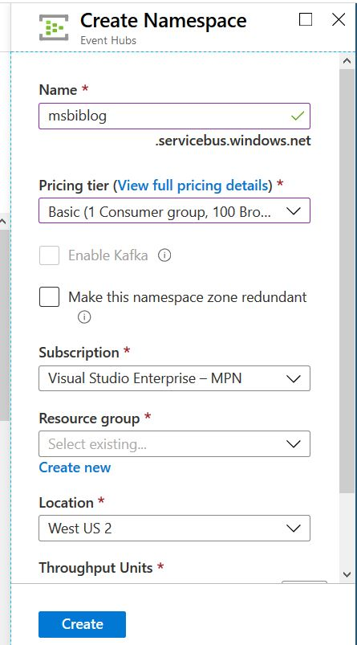
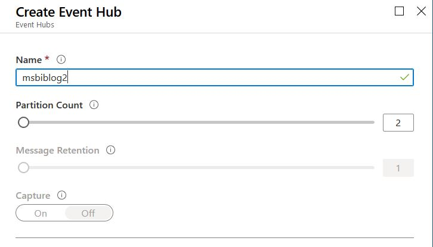
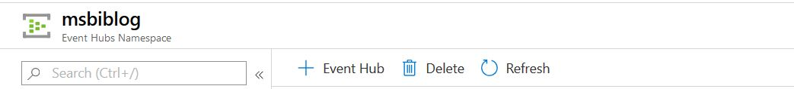
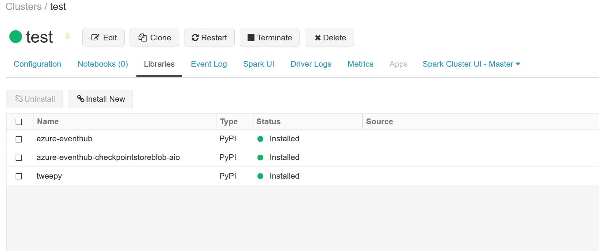
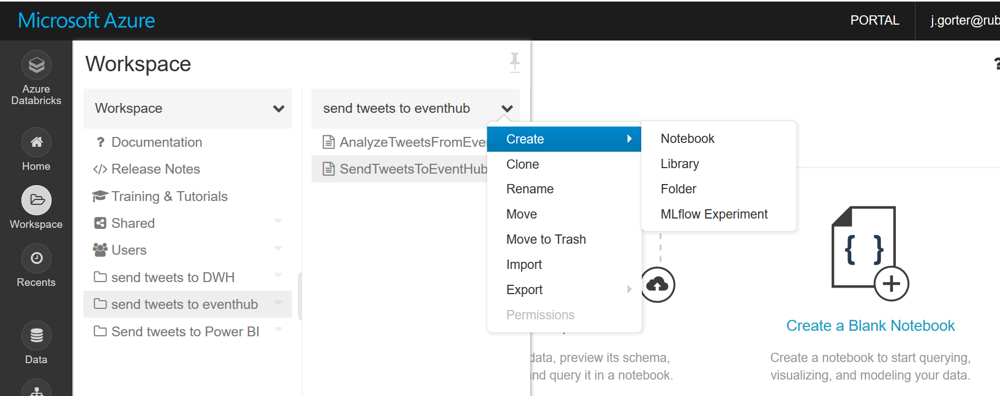
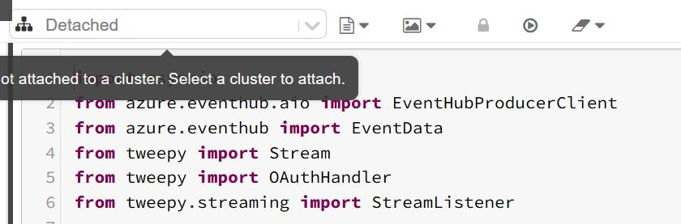
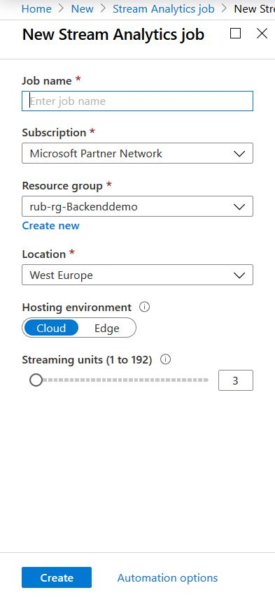
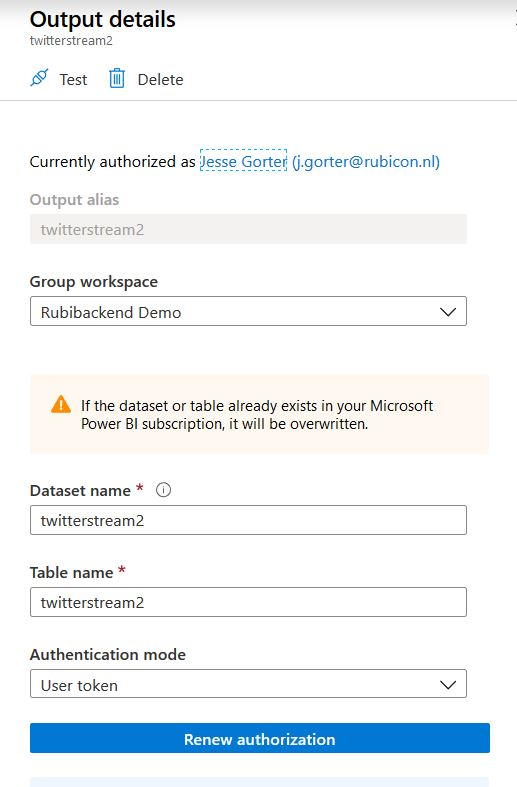
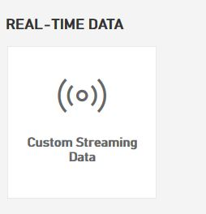

# Analyzing Twitter data in Power BI

In het onderstaande artikel laat Jesse Gorter zien hoe je Twitter-data in real-time naar Power BI kunt doorzetten.

Hij doet dit gebruikmakend van DataBricks.

Als oefening kun je proberen of jou dit ook lukt. Wat je nodig hebt:

* Een Twitter-account
* Een Twitter Application
  > If you want to use Twitter data, you will need a Twitter account and a Twitter application. Navigate to https://developer.twitter.com/en/apps and create a new app. Go to the application page and select the Keys and Tokens tab and remember the Consumer API Key and Consumer API Secret Key. Also, select Create under Access Token and Access Token Secret to generate the access tokens. Remember the Access Token and Access Token Secret.
  >
  > Bron: [Streaming Twitter data to Power BI with Azure](https://www.msbiblog.com/2020/02/17/streaming-twitter-data-to-power-bi-with-azure/)

Maak deze oplossing na, en bedenk wat je voor andere analyses zou kunnen / willen doen. De mogelijkheden zijn (bijna) eindeloos:

* Je kunt de data verrijken met Cognitive Services, [bijvoorbeeld door het sentiment van tweets te analyseren en toe te voegen](https://towardsdatascience.com/using-azure-cognitive-services-for-sentiment-analysis-of-trumps-tweets-part-1-f42d68c7e40a)
* Je kunt de code in plaats van op DataBricks op je eigen laptop draaien. Dan heb je wel een beetje voorkennis van Python en Pip (modules en installatie daarvan voor Python) nodig. Dat kan sowieso geen kwaad als Data Engineer.
* Wanneer je het op je eigen laptop werkend hebt, kun je op zoek naar een voordelige PaaS-oplossing. Bijvoorbeeld [in Azure Functions](https://docs.microsoft.com/nl-nl/azure/azure-functions/create-first-function-vs-code-python).
* Eén stap verder is om het vervolgens in DevOps te kunnen uitrollen. Zorg dat je je `requirements.txt` op orde hebt met de benodigde libraries!
* Oja, als je dan toch met een PaaS-oplossing bezig bent, kijk dan ook even naar security. Het is niet zo'n goed idee om Twitter App-credentials in de code te hebben staan. Je kunt hier in Azure Functions bijvoorbeeld de combinatie gebruiken van [Azure Functions Environment Variables met Azure KeyVault](https://levelup.gitconnected.com/a-secure-way-to-use-credentials-and-secrets-in-azure-functions-7ec91813c807).

Het artikel van Jesse is [hier](https://www.msbiblog.com/2020/02/17/streaming-twitter-data-to-power-bi-with-azure/) te vinden. Hieronder staat de tekst nogmaals (heel licht bewerkt) in Markdown opgenomen). Credits naar [Jesse Gorter](https://www.linkedin.com/in/jesse-gorter-3364261b/), [die ook een Vodcast over Azure host](https://www.youtube.com/channel/UCiUY0qrC95CB9urstm4EfZw):

> ## Streaming Twitter data to Power BI with Azure
>
> A modern data platform should be able to handle streaming data, both in batch and real time. We as a society have come to expect organizations and people to respond to situations *fast*. We cannot always wait a day until the data warehouse has processed the nightly batch to analyze the data the next day. Data needs to be addressed right in time, and some data needs to be handled faster than others.
>
> So, we could build two solutions: one for operation purposes that reacts to data right away, and one for the strategic operations. However, wouldn't it be nice if it all was consistent with each other? Do we really want 10 silo's for 10 problems that have 75% overlap? It sure creates more jobs for us consultants in BI, but that is not the goal of the client I think?
>
> So, how do we integrate streaming data in a dataplatform? Azure gives us a tool to streamline streaming data, it is called an *Event Hub.
>
> > Event Hubs represents the "front door" for an event pipeline, often called an event ingestor in solution architectures. An event ingestor is a component or service that sits between event publishers and event consumers to decouple the production of an event stream from the consumption of those events.  Event Hubs provides a unified streaming platform with time retention buffer, decoupling event producers from event consumers
> >
> > Source: https://azure.microsoft.com/en-us/services/event-hubs/.
>
> So why would you use a component like that?  
>
> Well, Event Hubs can receive events and send that data to a live Power BI dashboard, but it can also get send to a second pipeline to the data warehouse or a data lake for long term storage. Long time storage is interesting for different questions. Imagine flying a plane and there is a problem with the air pressure; you would like to know that *right away* on your dashboard so you can land the plane safely, but you also might want to remember how often there were problems so you can investigate.
>
> In this series, we are going to show how you can set up a streaming solution in Azure, streaming Twitter data to our data platform in Azure. I chose to use Twitter data, because it is a nice example of streaming data that can be interesting both real time and historical.
>
> ## Building it
>
> For starters, we are going to create an event hub namespace.
>
> * Create a new resource and choose event hub. This will create a namespace.  
>   * The name has to be unique
>   * choose a subscription and a resource group
>   * you can create a new resource group if you desire
>   * For this tutorial we use the basic tier which costs around 9 euro's a month.
>   * Review the settings and click create.
>
> 
>
> Once you have created the namespace, we can create event hubs.
>
> * Click on **+ Event hub** to create a new event hub.  
>   
>   * The amount of partitions that are required depends on the amount of parallel consumer applications that consume the stream of events.
>   * For this demo we can leave it at 2.
>
> 
>
> After you have created the event hub, we can go to the resource and further configure it. One thing we need to set up, is the access to the event hub. 
>
> * In the event hub name space left hand menu, under "entities", there is a link called 'event hubs'.
> * In the left blade click **Shared access policies** and then click **+ Add**.
>   * Make sure the access policy has **manage, send and listen** options checked.
>
> If you want to use Twitter data, you will need a Twitter account and a Twitter application. 
>
> * Navigate to https://developer.twitter.com/en/apps and create a new app.
>   * Copy the connection primary key somewhere where you can reference it, you will need it later.
>   * Go to the application page 
>   * select the Keys and Tokens tab 
>   * Copy the Consumer API Key and Consumer API Secret Key
>   * Select **Create** under **Access Token and Access Token Secret** to generate the access tokens
>   * Copy the Access Token and Access Token Secret
>
> Now we have an event hub that is ready to receive events, and a Twitter account that is configured to allow the sending of events. But we still need to actually stream Twitter events to our Event Hub. How do we do this?
>
> We are going to use Azure Databricks.
>
> Azure Databricks is an Apache Spark-based analytics platform optimized for the Microsoft Azure cloud services platform. This platform allows you to run Python, R, SQL or Scala notebooks on clusters that can easily scale out. This makes it very interesting to run machine learning tasks. Lately, you will find that more and more people also find it useful to create ELT / ETL pipelines. In this example, we are going to create a notebook, that can read Twitter data and send it to our Event Hub.
>
> * Go to the Azure portal
> * Create a new resource
>   * Search for "Azure databricks"
>   * click **create**
>   * Choose a subscription, resource group, location and pricing tier. 
>   * For the pricing, go for the standard. 
> * When the resource is created, navigate to it and click "Launch workspace".
>
> In the workspace, on the menu in the left, click "clusters". We have to set up a cluster to run our notebook. 
>
> * Click **create cluster** and give it a name
> * Review the settings:
>   * I choose workertype standard_ds3_v2 for testing purposes, but you may want to level that up to have faster performance.
>   * Remember to leave on the "terminate after ... minutes of inactivity" or you will be charged needlessly.
> * Once you are ready, click **create cluster**.
>
> To send data to Event Hubs from Twitter, we are going to need 3 Python libraries. Go to the cluster you just created and click on **libraries**:
>
> 
>
> * Click on **install new**
>   * choose PyPi
>   * fill in `azure-eventhub` in the package text field
>   * click **install**. 
> Repeat these steps for the modules `tweepy` and `azure-eventhub-checkpointstoreblob-aio`.
>
> Now that we have a cluster, it is time to create a notebook that will send the data to our Event Hub:
>
> 
>
> Make sure the notebook is a python notebook. 
>
> We can now add the script to send data to our Event Hub.
>
> ```python
> import asyncio
> from azure.eventhub.aio import EventHubProducerClient
> from azure.eventhub import EventData
> from tweepy import Stream
> from tweepy import OAuthHandler
>
> async def run(text):
>     producer = EventHubProducerClient.from_connection_string(conn_str="Endpoint=sb://<NAME OF YOUR EVENTHUB NAMESPACE>.servicebus.windows.net/;SharedAccessKeyName=<NAME OF YOUR SHARED ACCESS KEY>;SharedAccessKey=<SHAREDACCES KEY>=", eventhub_name="<NAME OF YOUR EVENTHUB>")
>     async with producer:
>         # Create a batch.
>         event_data_batch = await producer.create_batch()
>         event_data_batch.add(EventData(text))
>         await producer.send_batch(event_data_batch)
>        
> class listener(Stream):
>    
>     def on_data(self, data):
>         loop = asyncio.get_event_loop()
>         loop.run_until_complete(run(data))
>         print(data)
>         return(True)
>
>     def on_error(self, status):
>         print(status)
> #consumer key, consumer secret, access token, access secret.
> ckey="<TWITTER CONSUMER KEY>"
> csecret="<TWITTER CONSUMER SECRET>"
> atoken="<TWITTER ACCESS TOKEN>"
> asecret="<TWITTER ACCESS SECRET>"
>
> auth = OAuthHandler(ckey, csecret)
> auth.set_access_token(atoken, asecret)
>
> twitterStream = listener(ckey, csecret, atoken, asecret)
> twitterStream.filter(track=["<KEYWORD YOU WANT TO LOOK FOR IN TWITTER>"])
> ```
>
> Be sure to fill in the values in for all the `<>` values I left in, such as `<TWITTER ACCESS TOKEN>`.
>
> You can now attach the cluser to the notebook, by clicking on **Detached** and selecting the cluster you just created.
>
> 
>
> Now it is time to run the notebook. The notebook will send events to your Event Hub.
>
> So how do we get data streamed to Event Hubs into Power BI? We can use Azure Stream Analytics to do this. This is a real time analytics platform that can handle streaming data from Event Hubs and send it to Power BI for example.
>
> * Create a new Azure component
>   * Choose Stream Analytics job
>   * Give the job a name
>   * Keep cloud as the hosting environment (this is selected by default)
>
> This will deploy the job to Azure. You can also deploy the job to an on-premises IoT Gateway device, but for now we are not doing that. The amount of streaming units can be set higher for more compute resources to handle the query.
>
> 
>
> Once the job is created, we are going to define the inputs, the query and an output. The input is going to be our Event Hub. 
>
> To create an input:
>
> * On the left menu under **job topology**, click **inputs**
> * Create a new **stream input**, choose **Event Hub** as the source.
> * Select **Select Event Hub from your subscriptions** and choose the Event Hub that you created earlier.
> * Under **Event Hub policy name** you specify the shared access policy name we created earlier. Test and save the query.
>
> Now we have to create an output:
>
> * Create a new output 
>   * Select Power BI as the type
>   * Now you need to login to Power BI to select a workspace where Stream Analytics will stream to:
>
> 
>
> Give your dataset and table a name, save and test the output. 
>
> Now we just need to write the query to start streaming from the Event Hub to Power BI!
>
> Go to **query** and type the following
>
> ```sql
> SELECT
>     *, 1 as tweetamount
>     INTO [YOUROUTPUTNAME]
> FROM
>     [YOURINPUTNAME]
> ```
>
> Replace the values with the names of your input and output. Save the query, go to overview and start the job.
>
> You now have a streaming dataset that will be visible in Power BI! If you want live refreshes on your dashboard in realtime, you can create a dashboard and create a live tile: 
> * Navigate to **Power BI Portal**
>   * Click on "create tile"
>   * Choose "custom streaming data".
>
> 
>
> Now choose a visualization type and you are good to go!
>
> You have streamed *LIVE* data to Power BI from a realtime stream: Twitter.
>
>
>
> Next time, we will cover how to store this information to your data lake and data warehouse for long time storage.
>
> Source: [https://www.msbiblog.com/2020/02/17/streaming-twitter-data-to-power-bi-with-azure/](https://www.msbiblog.com/2020/02/17/streaming-twitter-data-to-power-bi-with-azure/)